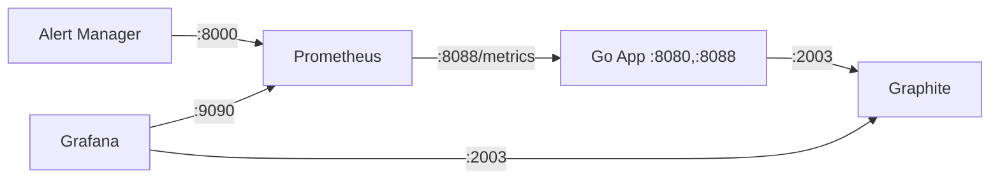

# Мониторинг систем на Go

## 1. **Push / Pull модели сбора метрик**

* **Pull модель** — система мониторинга (например, Prometheus) сама опрашивает приложение по HTTP-эндпоинту (`/metrics`).

  * Преимущества: проще масштабирование, меньше зависимостей на приложении.
  * Недостатки: плохо работает с динамическими средами (например, Kubernetes без service discovery).
* **Push модель** — приложение само отправляет метрики в хранилище (например, Graphite).

  * Преимущества: подходит для динамически масштабируемых приложений.
  * Недостатки: больше нагрузки на приложение, сложнее отладка.

---

## 2. **Виды метрик**

* **Counter** — монотонно возрастающее значение (например, количество запросов).
* **Gauge** — значение, которое может как расти, так и убывать (например, использование памяти).
* **Histogram** — распределение значений по бакетам (например, латентность).
* **Summary** — как histogram, но с квантилями (менее предпочтителен в Prometheus).

---

## 3. **Prometheus / Graphite**

* **Prometheus**

  * Язык запросов: PromQL.
  * Использует pull-модель.
  * Поддерживает labels, service discovery.
* **Graphite**

  * Использует push-модель.
  * Простой формат хранения: `path.value.timestamp`.
  * Менее гибкий по сравнению с Prometheus.

---

## 4. **Алерты**

* Алерты в Prometheus настраиваются через `PrometheusRule` или `alertmanager.yml`.

### Пример алерта:

```yaml
groups:
- name: example
  rules:
  - alert: HighErrorRate
    expr: rate(http_requests_total{status="500"}[5m]) > 1
    for: 1m
    labels:
      severity: critical
    annotations:
      summary: "Высокий уровень ошибок 500"
```

### Типовые алерты:

* Высокий процент 5xx ошибок.
* Повышенная latency.
* Кол-во активных горутин.
* Переполнение очередей.
* Недоступность сервисов (uptime = 0).

---

## 5. **Grafana**

* Используется для визуализации метрик из Prometheus / Graphite.
* Подключение источников:

  * Prometheus: URL типа `http://prometheus:9090`.
  * Graphite: `http://graphite:80`.

### Инструкция по созданию дашборда:

1. Добавить Data Source.
2. Создать Dashboard → Add Panel.
3. В панели выбрать источник и написать PromQL-запрос.
4. Настроить визуализацию: граф, гейдж, таблица и т.п.
5. Сохранить и экспортировать/импортировать JSON при необходимости.

---


## 6. Архитектура сбора метрик

